# 本周实验目标主要解决了：

1. 平台中后台整体布局，包括侧边导航、顶部栏、内容容器和移动端底部导航
2. 接入 shadcn/ui，并解决其与 TailwindCSS v3 的兼容问题
3. 封装一批可复用的通用业务组件，为后续业务模块开发提供基础组件库。
4. 完成桌面端和移动端的响应式布局适配。
5. 配置路由级 Loading、Error Boundary 和 404 页面
6. 保证所有组件通过 TypeScript、ESLint 和 Prettier 检查。

## 新增和整理的布局组件包括

1. src/components/layout/app-sidebar.tsx 负责桌面端左侧导航
2. src/components/layout/app-topbar.tsx 负责顶部栏、当前页面标题和清凉面包屑展示
3. src/components/layout/page-container.tsx 负责统一月面内容区宽度、 padding 和移动端底部留白
4. src/components/layout/mobile-tabbar.tsx 负责移动端底部导航
5. src/app/(workspace)/layout.tsx 组合全局布局结构

## 最终新城的布局结构为

### 桌面端

### 移动端

## 为了避免导航项在多个组件中重复定义，本周新增了统一导航配置文件

src/lib/navigation.ts 其中维护了 workspaceNavItems、routeTitleMap

workspaceNavItems 用于侧边栏和移动端底部导航，routeTitleMap 用于顶部栏根据当前路由展示页面标题。
这样可以避免在 AppSidebar、MobileTabbar、AppTopbar 中重复写路由信息，提高代码一致性。

## 接入shadcn/ui

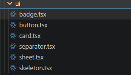
作为项目基础UI组件来源

### 解决了 shadcn/ui 与 TailwindCSS v3的兼容问题

### 解决方案

1. 移除 globals.css 中不兼容 Tailwind v3 的 import 和 preset。
2. 保留 Tailwind v3 兼容的 @tailwind base/components/utilities。
3. 在 tailwind.config.js 中补充 shadcn 所需的语义色变量映射，例如 border、background、foreground、card 等。
4. 将 card.tsx 调整为 Tailwind v3 兼容写法，移除 --spacing(...) 类名。

## 封装通用业务组件库

src/components/business/page-header.tsx
src/components/business/section-card.tsx
src/components/business/metric-card.tsx
src/components/business/filter-bar.tsx
src/components/business/base-table.tsx
src/components/business/pagination.tsx
src/components/business/detail-drawer.tsx

src/components/common/empty-state.tsx
src/components/common/error-state.tsx
src/components/common/loading-state.tsx

### Page-header

用于统一页面标题区域，包括：

页面标签
页面标题
页面描述
右侧操作区

使用位置：
/dashboard
/creators
/content
/audience
/assistant
/settings

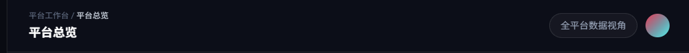

### Section-Card

用于统一页面内容区块，例如：

核心指标概览
创作者列表
视频内容列表
图表区块
榜单区块

它封装了 shadcn/ui 的 Card、CardHeader 和 CardContent，减少页面中重复写卡片结构。
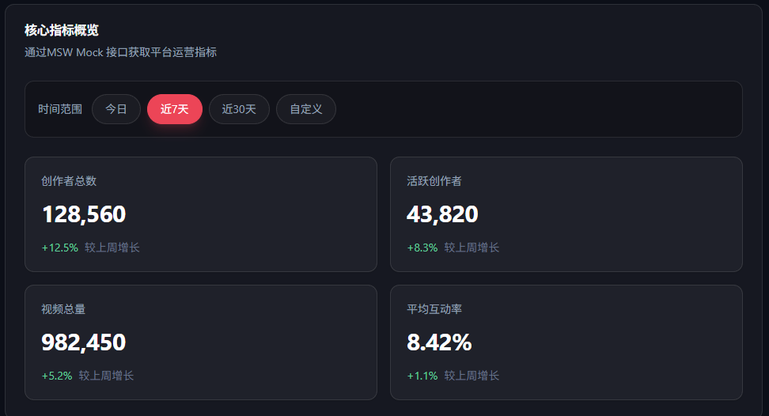

### MetricCard

用于展示核心指标卡片，例如：

- 创作者总数
- 活跃创作者数
- 视频总量
- 平均互动率

支持：

- 指标标题
- 指标数值
- 趋势变化
- 描述文字
- 图标扩展

当前已经用于 Dashboard 平台数据大盘。
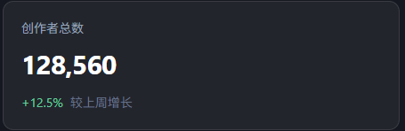

### FilterBar

用于封装筛选栏，目前支持按钮式筛选项。

当前用于 Dashboard 时间范围筛选：

今日 / 近 7 日 / 近 30 日 / 自定义

实现过程中还处理了泛型类型问题，使 FilterBar<DashboardDateRange> 能正确接收业务类型，而不是退化为普通 string 类型。

### EmptyState

用于统一空状态展示，例如：

- 内容列表为空
- 筛选无结果
  = 创作者列表暂无数据
- 热点榜单暂无内容

当前已在内容管理页面进行了测试。
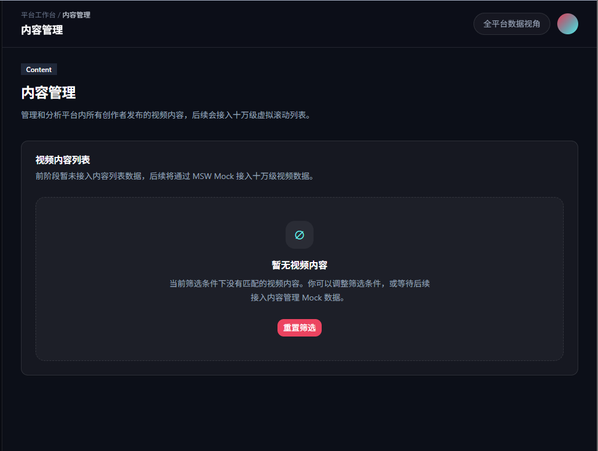

### ErrorState

用于统一异常状态展示，例如：

- 接口请求失败
- Mock 接口未命中
- 页面渲染异常
- 网络错误

当前已经用于 Dashboard 请求失败状态，并支持“重新加载”操作。
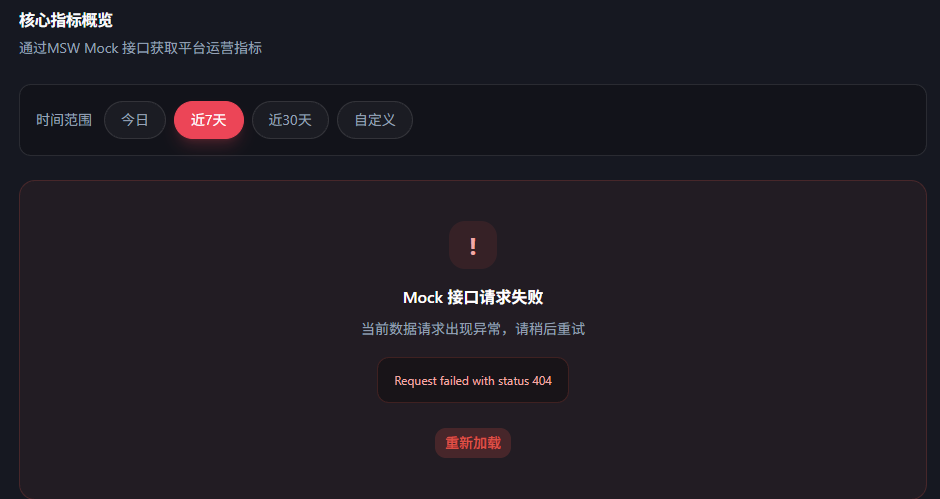

### LoadingState

用于统一加载状态和骨架屏展示。
当前已经替换 Dashboard 中原本简单的“正在请求 Mock 数据...”文字提示，使加载过程更加接近真实中后台体验。

### BaseTable + Pagination + DetailDrawer

用于封装基础表格能力，支持：

- columns 配置
- data 数据源
- rowKey
- loading 骨架屏
- empty 空状态
- 对齐方式
- 列宽
- 自定义单元格渲染
- 当前页
- 每页数量
- 总数据量
- 页码切换
- 上一页 / 下一页
- pageSize 切换
- 移动端简化展示

当前已在创作者分析页面中使用。
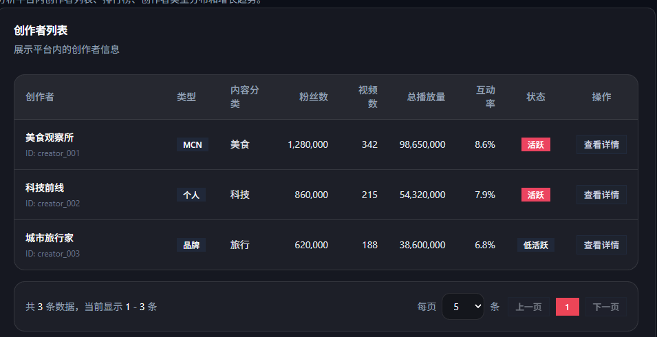

## 新增路由级 Loading、Error、404页面

新增文件：

- src/app/(workspace)/loading.tsx
- src/app/(workspace)/error.tsx
- src/app/not-found.tsx

loading.tsx：用于工作台页面加载时展示统一 Loading 骨架屏。

error.tsx： 用于工作台页面运行时报错时展示统一错误界面，并提供重新加载能力。

not-found.tsx： 用于访问不存在路由时展示 404 页面，并提供返回平台总览入口。

这样项目在加载、异常和不存在页面场景下都有统一的用户反馈，不再直接白屏或显示默认错误页面。

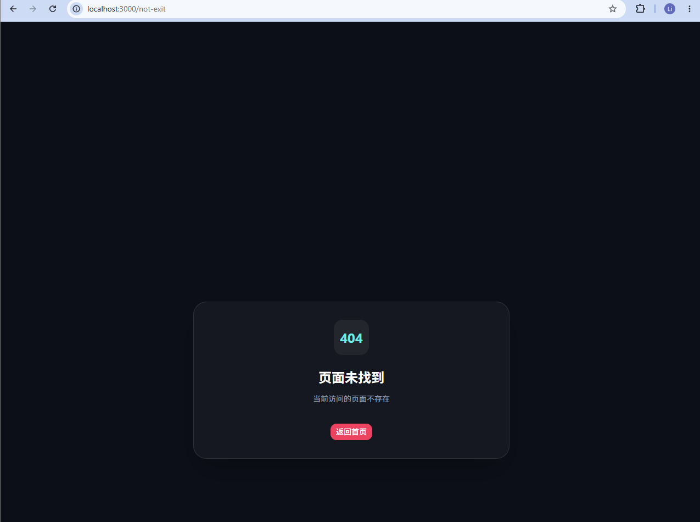

## 本周遇到过的问题

### shadcn CLI 无法识别 Tailwind 配置

解决方案：

- 检查 tailwind.config.js
- 检查 src/app/globals.css
- 调整 globals.css 后重新执行 shadcn CLI
- 最终 shadcn 初始化成功

### Tailwind v3 与 shadcn 新 preset 冲突

接入 shadcn 后，出现了 --spacing(3) 相关报错。
原因是新版 shadcn preset 中包含 Tailwind v4 风格语法，而项目使用 TailwindCSS v3。

解决方案：

- 移除 globals.css 中不兼容的 preset import
- 保留 Tailwind v3 写法
- 补充 tailwind.config.js 中的 shadcn 语义色变量
- 修改不兼容的 card.tsx class 写法

## 总结与效果展示

第二周主要完成了系统的全局布局和通用组件库建设。通过拆分 AppSidebar、AppTopbar、PageContainer 和 MobileTabbar，项目形成了清晰的中后台布局结构，并同时适配桌面端和移动端。
在组件库方面，本周接入 shadcn/ui，并在其基础上封装了 PageHeader、SectionCard、MetricCard、FilterBar、BaseTable、Pagination、DetailDrawer 等通用业务组件，同时补充了 EmptyState、ErrorState 和 LoadingState 等状态组件。通过这些组件，后续业务模块可以快速搭建页面结构，避免重复开发。
此外，本周还处理了 shadcn/ui 与 TailwindCSS v3 的兼容问题，优化了移动端分页器表现，并补齐了路由级 Loading、Error 和 404 页面。至此，项目已经具备较完整的布局系统、基础组件体系和响应式适配能力，为第三周数据大盘模块开发打下了基础。
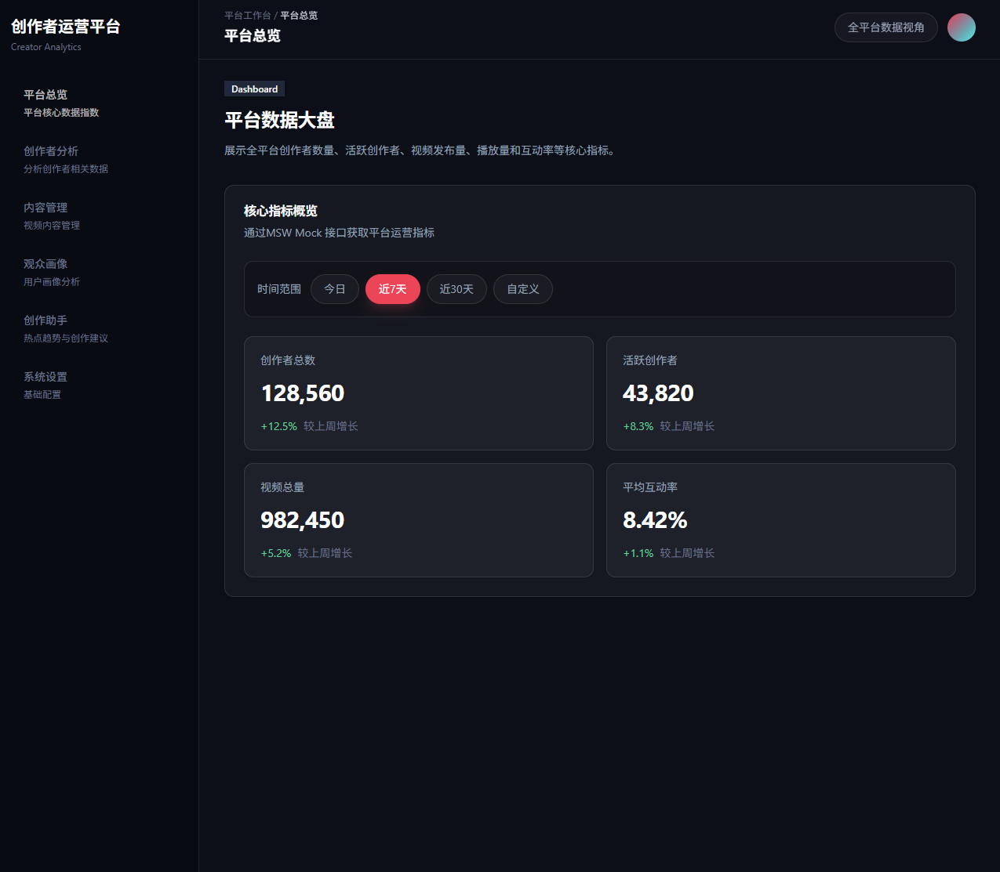
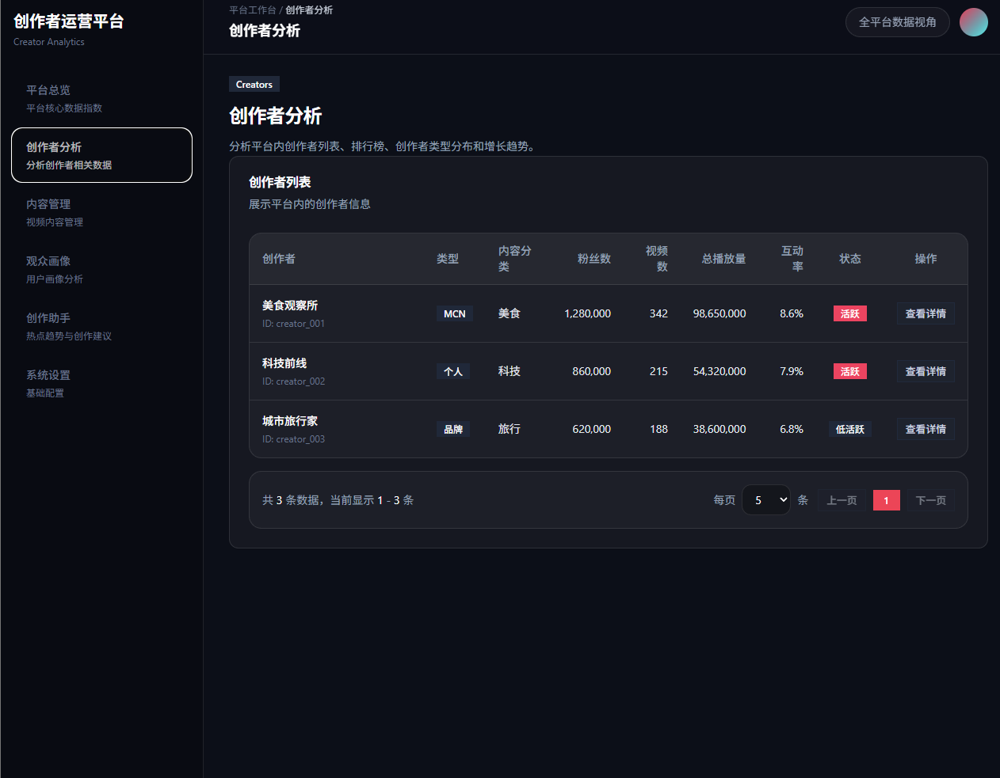
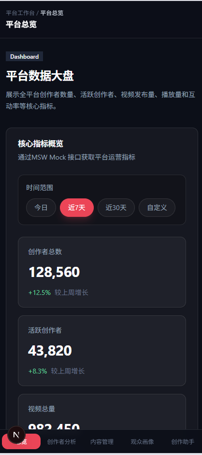
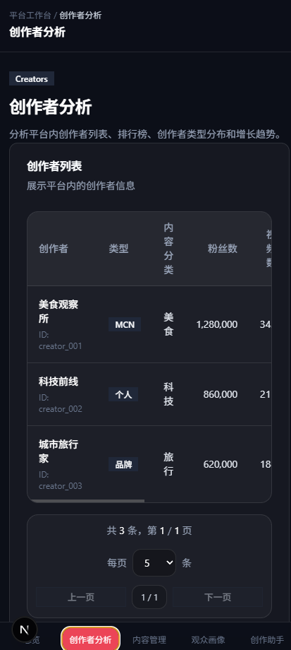
