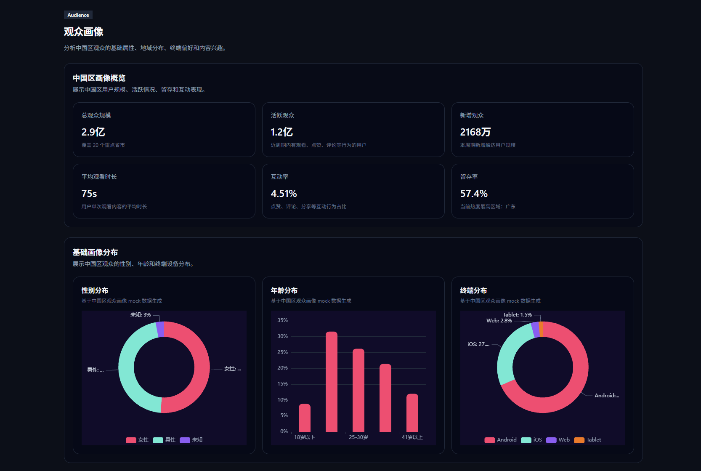
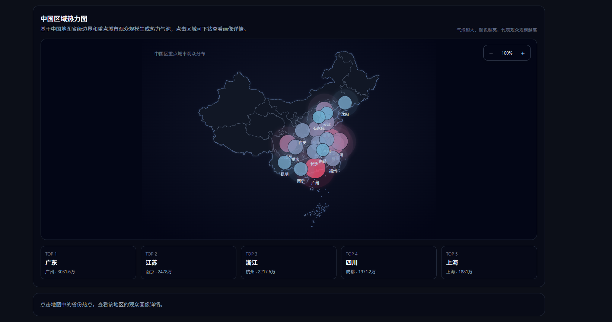
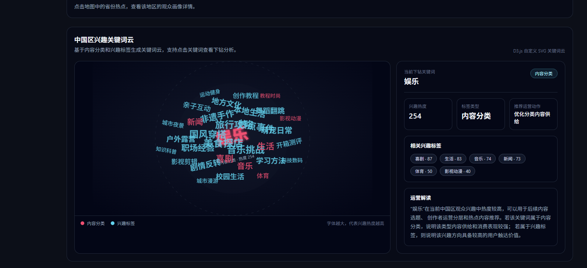
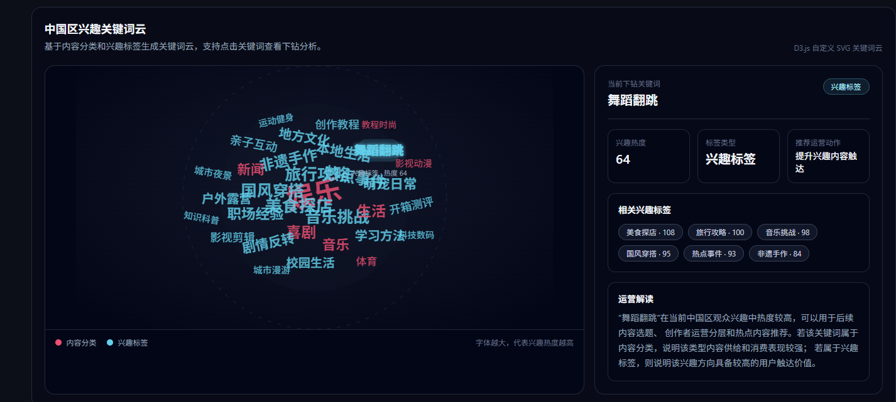
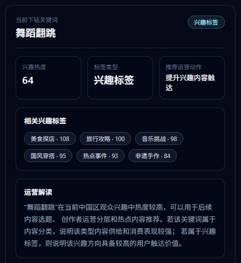

# 第五周实验报告：观众画像模块与自定义可视化

## 本周实验目标：

1. 生成中国区观众画像Mock数据
2. 定义观众画像模块的数据类型
3. 接入观众画像相关的MSW Mock接口
4. 封装Audience Serivce层
5. 完成/audience 页面基础布局
6. 使用Echarts 实现性别年龄、终端分布图
7. 使用D3.js 实现中国区热力图
8. 在中国地图中叠加重点城市观众热力气泡
9. 支持点击省份/城市热点后展示区域下钻详情
10. 使用D3.js 实现中国区兴趣关键词云
11. 支持点击关键词查看兴趣下钻详情
12. 补充loading、empty、error状态
13. 适配神色模式下的图标展示效果

### 本周新增依赖

- pnpm add d3 @faker-js/faker
- pnpm add -D @types/geojson

### 观众画像生成命令

pnpm data:audience

区域数据包括：

广东 / 广州
江苏 / 南京
浙江 / 杭州
上海 / 上海
北京 / 北京
四川 / 成都
山东 / 济南
河南 / 郑州
湖北 / 武汉
福建 / 福州
湖南 / 长沙
重庆 / 重庆
陕西 / 西安
安徽 / 合肥
辽宁 / 沈阳
云南 / 昆明
广西 / 南宁
江西 / 南昌
天津 / 天津
河北 / 石家庄

### MSW接口设计

- 数据层： src/mocks/data/audience.ts
- handler: src/mocks/handlers/audience.ts

- GET /api/audience/overview 获取中国区观众画像概览
- GET /api/audience/demographics 获取性别、年龄、终端分布
- GET /api/audience/regions 获取中国区域热力图数据
- GET /api/audience/keywords 获取兴趣关键词云数据
- GET /api/audience/regions/:regionId 获取单个区域下钻详情

## /audience页面基础布局

整体结构：
AudiencePageContent
AudienceOverviewSection
AudienceDemographicsSection
AudienceRegionSection
ChinaAudienceHeatmap
RegionDetailPanel
AudienceKeywordSection
AudienceKeywordCloud
KeywordDetailPanel

页面加载时会并发请求：
overview
demographics
regions
keywords

### 中国区画像概述模块

展示指标包括：
总观众规模
活跃观众
新增观众
平均观看时长
互动率
留存率

###基础画像图表
src/features/audience/components/audience-demographics-section.tsx
src/features/audience/components/audience-demographic-chart.tsx

其中包括性别分布、年龄分布、终端分布
性别分布：ECharts 环形图
年龄分布：ECharts 柱状图
终端分布：ECharts 环形图

### D3中国区热力图

src/features/audience/components/china-audience-heatmap.tsx
该组件使用 D3.js 完成自定义 SVG 可视化，主要包括：

加载中国地图 GeoJSON。

1. 使用 d3.geoMercator 创建地图投影。
2. 使用 d3.geoPath 绘制中国省级边界。
3. 根据省份 / 重点城市经纬度计算气泡坐标。
4. 使用观众规模映射气泡半径。
5. 使用观众规模映射气泡颜色。
6. 支持 hover 和 click 交互。
7. 支持点击空白区域取消选中。
   地图数据文件放在：public/maps/china.geo.json
   

在中国地图上，叠加了重点城市热点气泡
每个气泡使用区数据中的：lng,lat,audienceCount进行渲染
逻辑包括：

1. 气泡位置：由 lng / lat 经过 D3 projection 计算得到
2. 气泡大小：由 audienceCount 经过 scaleSqrt 映射得到
3. 气泡颜色：由 audienceCount 经过 sequential color scale 映射得到
   气泡越大、颜色越亮，表示该地区观众规模越高

### 区域下钻交互

交互规则如下:

1. hover 省份或气泡：展示 tooltip
2. 点击省份或气泡：选中该区域并加载区域详情
3. 再次点击同一区域：取消选中
4. 点击地图空白区域：取消选中

这个交互优化解决了之前的体验问题：
一开始选中某个省份后，tooltip 会一直保留，只有点击另一个区域才会变化。后续通过清空 selectedRegionId 和 hoveredRegionId，实现了点击同一区域或空白区域隐藏 tooltip 的效果。

区域详情模块展示：

- 观众规模
- 活跃率
- 互动率
- 热门分类
- 性别分布
- 年龄分布
- 终端分布
- 区域兴趣关键词
  对应组件为：src/features/audience/components/audience-region-section.tsx
  

### D3兴趣关键词云

对应组件：src/features/audience/components/audience-keyword-cloud.tsx
关键次包含两类：内容分类类关键词、兴趣标签类关键词
例如：娱乐
生活
音乐
科技
美食探店
城市漫游
校园生活
剧情反转
知识科普
地方文化

关键词云使用D3 scale完成以下映射：

- 关键词热度 -> 字体大小
- 关键词类型 -> 颜色
- 关键词 index -> 螺旋式布局位置
  其中：
- 内容分类使用偏粉色系
- 兴趣标签使用青蓝色系。
- 字体越大表示兴趣热度越高。
  

### 关键词下钻交互

本周实现了关键词下钻面板：src/features/audience/components/audience-keyword-section.tsx
用户点击关键词云中的任意关键词后，右侧详情面板会展示：

- 当前下钻关键词
- 兴趣热度
- 标签类型
- 推荐运营动作
- 相关兴趣标签
- 运营解读
  

### Loading、Empty、Error状态

页面逻辑：

- loading === true -> 展示画像页面骨架屏
- errorMessage有值 -> 展示异常状态
- overview/demographics/regions/keywords 任意为空 -> 展示空状态
- 数据正常 -> 展示完整观众画像页面

### 深色模式适配

本项目整体采用深色后台风格，因此本周在可视化组件中重点适配了深色模式。

主要处理包括：

1. 图表背景使用 slate / dark 色系
2. 坐标轴文字使用浅灰色
3. 地图边界使用蓝灰色
4. 热点气泡使用高饱和度颜色
5. tooltip 使用深色半透明背景
6. 关键词云使用粉色 / 青色区分标签类型
7. 选中状态增加高亮描边和背景
