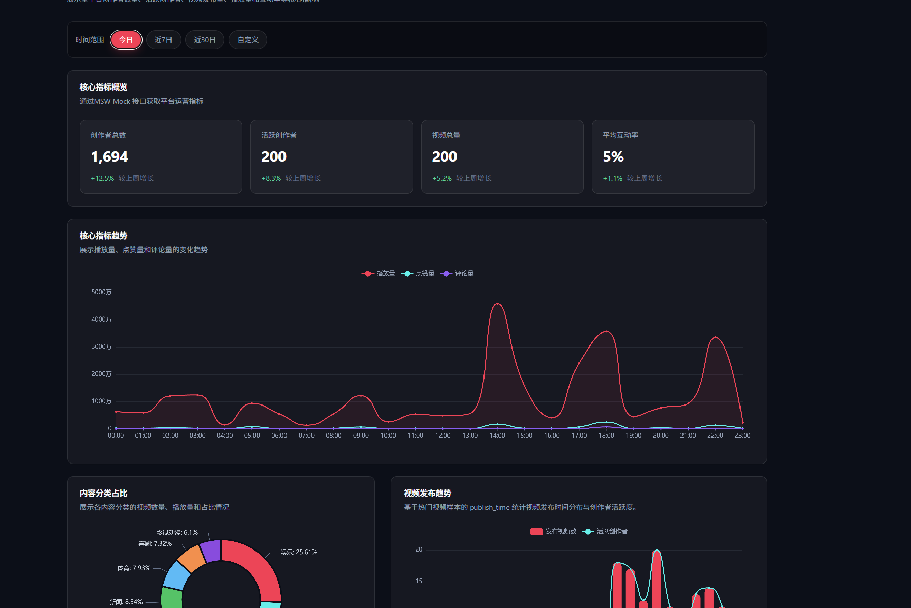
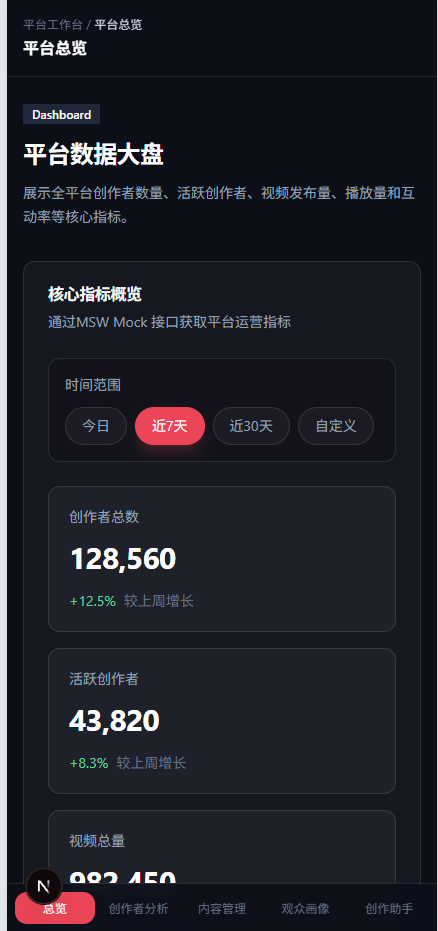

# 创作助手模块

## 本周实现

1. 基于内容管理模块生成的历史内容数据，构建创作助手 Mock 分析数据。
2. 实现热点内容榜单，用于展示历史表现较好的内容样本。
3. 实现分类趋势分析模块，辅助判断不同内容分类的运营价值。
4. 实现发布时间推荐模块，基于历史发布时间和内容表现推荐优选时段。
5. 实现标题词频分析模块，辅助创作者优化标题表达。
6. 实现创作建议清单，将热点内容、分类趋势、发布时间和标题关键词转化为可执行建议。
7. 接入 Framer Motion，优化页面进入动画、卡片 hover 动效和建议详情切换动画。
8. 补充 loading、empty、error 等边缘状态。

## 新增创作助手数据生成脚本

scripts/build-assistant-data.mjs

该脚本读取内容管理模块： data/processed/content-list.json
然后基于历史内容表现生成传作助手模块需要的数据文件：
- data/processed/assistant-overview.json
- data/processed/assistant-hot-contents.json
- data/processed/assistant-category-trends.json
- data/processed/assistant-publish-times.json
- data/processed/assistant-title-keywords.json
- data/processed/assistant-suggestions.json

## 热点内容榜单数据生成

热点内容榜单基于历史内容数据中的核心指标计算，包括：
- playCount
- likeCount
- commentCount
- shareCount
- engagementRate
- category
- publishTime

脚本通过综合热度分hotScore对内容进行排序。热度分主要考虑：
- 播放量权重
- 点赞量权重
- 评论量权重
- 互动率权重

然后选取排名靠前的内容作为热点内容榜单数据。每条热点内容包含：
- rank
- title
- creatorName
- category
- publishSlot
- playCount
- likeCount
- commentCount
- shareCount
- engagementRate
- hotScore
- reasonTags

## 发布时间推荐算法

本周实现了基于历史数据统计的发布时间推荐算法。该算法读取每条内容的 publishTime，转换为中国时区下的：
- weekday
- hour
然后按“星期 + 小时”聚合内容表现，统计每个时间段的：
- sampleCount
- avgPlayCount
- avgEngagementRate
- competitionLevel
- competitionText
- expectedPlayLift
- score
发布时间推荐分综合考虑：
- 平均播放量
- 平均互动率
- 样本竞争程度
这样可以得到类似：
- 周五 20:00
- 周六 21:00
- 周日 19:00

## 创作建议生成

创作建议是基于前面几个分析结果规则生成的：
- topCategory -> 推荐加大某分类内容供给
- bestPublishTime -> 推荐最佳发布时间
- topKeyword -> 推荐标题关键词
- hotContents[0] -> 推荐参考 TOP 热点内容

建议类型包括：
- category
- publish_time
- title
- topic
- hot_content

每条建议包含：
- title
- type
- priority
- reason
- action

这样页面不仅展示分析结果，还能把结果转化为更直接的运营动作，例如：
- 加大某分类内容供给
- 优先选择某时间段发布
- 标题中加入某类表达
- 参考 TOP 热点内容结构

## 基础页面布局

本周修改页面入口：
- src/app/(workspace)/assistant/page.tsx

页面标题为：创作助手
页面描述：基于历史内容表现分析热点榜单、分类趋势和创作优化方向，辅助创作者制定内容策略。
主体组件: src/features/creator-assistant/components/creator-assistant-page-content.tsx

页面整体结构：

- CreatorAssistantPageContent
-     CreatorAssistantOverviewSection
-     CreatorAssistantHotContentList
-     CreatorAssistantCategoryTrendSection
-     CreatorAssistantPublishTimeSection
-     CreatorAssistantTitleKeywordSection
-     CreatorAssistantSuggestionSection

### 创作助手概览模块

该模块展示：
- 热点内容样本数
- 趋势分类
- 推荐发布时间
- 高频标题词

### 热点内容榜单模块

该模块展示前 10 条热点内容，每条内容包含：
- 排名
- 标题
- 创作者
- 分类
- 推荐发布时间段
- 热度分
- 播放量
- 点赞量
- 评论量
- 互动率
- 推荐标签

### 分类趋势分析模块

该模块展示不同内容分类的趋势表现，包括：
- 分类名称
- 样本数量
- 播放量
- 趋势分
- 平均互动率
- 点赞量
- 趋势状态
- 运营建议

趋势状态使用不同颜色标签区分：
- 快速上升
- 稳定表现
- 潜力分类

### 发布时间推荐模块

该模块展示历史数据中表现较好的发布时间段。每个推荐时段展示：
- 推荐时段
- 推荐分
- 平均播放
- 平均互动率
- 样本数量
- 预计播放提升
- 竞争程度
- 推荐理由

### 标题词频分析模块

该模块最初只展示了一组胶囊标签和右侧明细列表，页面左侧区域显得过空，视觉重心不平衡。后续进行了样式优化，将其改为：
- 左侧：高频标题词云 + 当前选中关键词解析
- 右侧：TOP 关键词明细列表

### Framer Motion 动效接入

本周接入 Framer Motion，用于优化页面交互体验。第六周验收标准中要求动画自然流畅，无突兀感与性能问题，并要求整体交互符合字节产品体验规范。

1. 页面模块进入时的渐入动画
2. 创作建议卡片 hover 上浮
3. 创作建议卡片点击时轻微缩放
4. 建议详情切换时的进入 / 离开动画
5. 标题关键词点击后的详情区域切换动画
   

### Loading、Empty、Error 状态

loading === true
-> 展示骨架屏

errorMessage 有值
-> 展示错误提示

overview / hotContents / categoryTrends / publishTimes / titleKeywords / suggestions 任意为空
-> 展示空状态

数据正常
-> 展示完整创作助手页面
