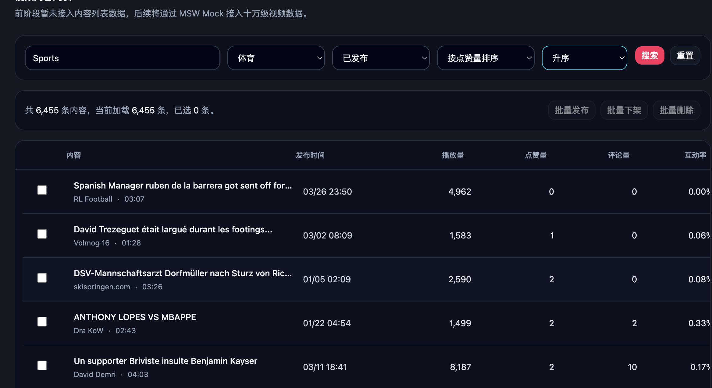
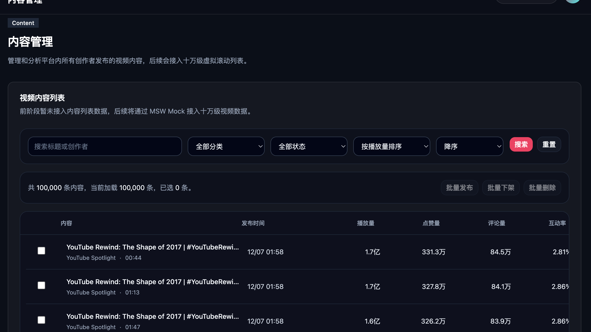
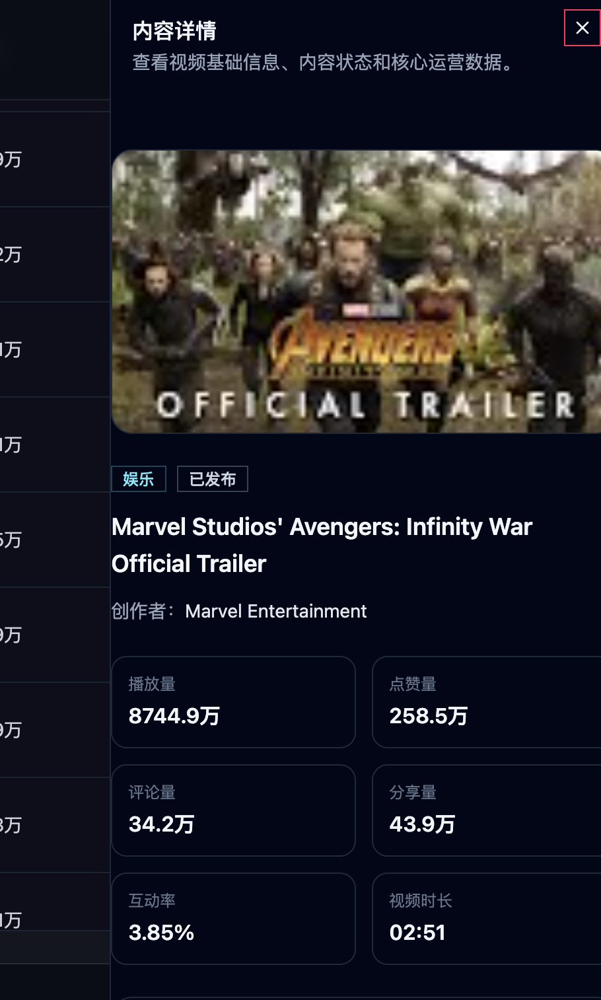

# 内容管理模块与高性能列表开发。

## 数据生成命令

pnpm data:content
本地访问地址： http://localhost:3000/content

## 为了模拟真实内容管理后台的大数据量场景，本周基于已经下载的公开视频数据集生成了内容管理列表数据。

数据来源主要包块：

- data/raw/*videos.csv
- data/raw/*_category_id.json
  数据清洗脚本：
- scripts/build-content-data.mjs

该脚本完成以下工作：

1. 读取多个地区的视频 CSV 文件。
2. 读取对应的分类 JSON 文件。
3. 将 category_id 映射为中文内容分类。
4. 解析视频标题、创作者名称、发布时间、播放量、点赞数、评论数等字段。
5. 根据点赞数和评论数模拟分享数。
6. 计算互动率。
7. 根据原始数据扩展生成十万条内容数据。
8. 输出内容管理模块可使用的 JSON 文件。

## 本周新增内容管理模块类型文件

- src/types/content.ts

## 核心类型包括

- ContentVideo
- ContentStatus
- ContentSortField
- ContentListQuery
- ContentListResponse
- BatchUpdateContentStatusPayload
- BatchDeleteContentPayload

其中 ContentVideo 表示单条视频内容，主要字段包括：

- id
- sourceVideoId
- title
- creatorName
- category
- region
- coverUrl
- publishTime
- duration
- playCount
- likeCount
- commentCount
- shareCount
- engagementRate
- status

## 新增MSW Mock接口

- src/mocks/data/content.ts
- src/mocks/handlers/content.ts

主要接口包括：

- GET /api/content/list 获取内容列表，支持关键词、分类、状态和排序
- GET /api/content/categories 获取所有内容分类
- GET /api/content/:id 获取单条内容详情
- POST /api/content/batch-status 批量更新内容状态
- POST /api/content/batch-delete 批量删除内容

列表接口支持以下查询能力：

- keyword：根据标题或创作者搜索
- category：根据分类筛选
- status：根据状态筛选
- sortBy：根据播放量、点赞量、评论量、发布时间、互动率等字段排序
- sortOrder：升序或降序
  

## 本周使用 react-window实现十万级虚拟滚动列表。

对应组件为：

- src/features/content/components/content-virtual-list.tsx
  本项目中使用 FixedSizeList 实现固定高度列表项，每一行高度为 72px。列表滚动时，react-window 会根据当前滚动位置计算需要展示的内容行，只挂载可视区域附近的 DOM 节点，从而显著降低渲染压力
  

## 内容详情抽屉实现

对应独立组件：

- src/features/content/components/content-detail-drawer.tsx
  详情抽屉使用 shadcn/ui 的 Sheet 组件实现右侧滑入动画。点击列表中的任意一行后，会将当前内容设置为 activeContent，并打开详情抽屉。
  
